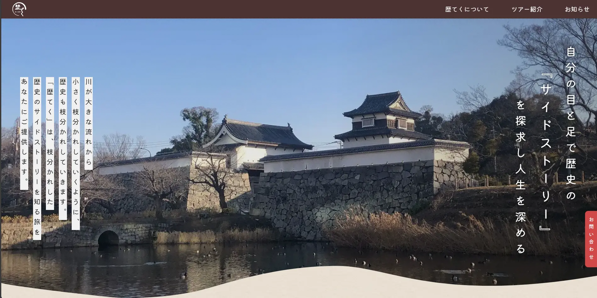
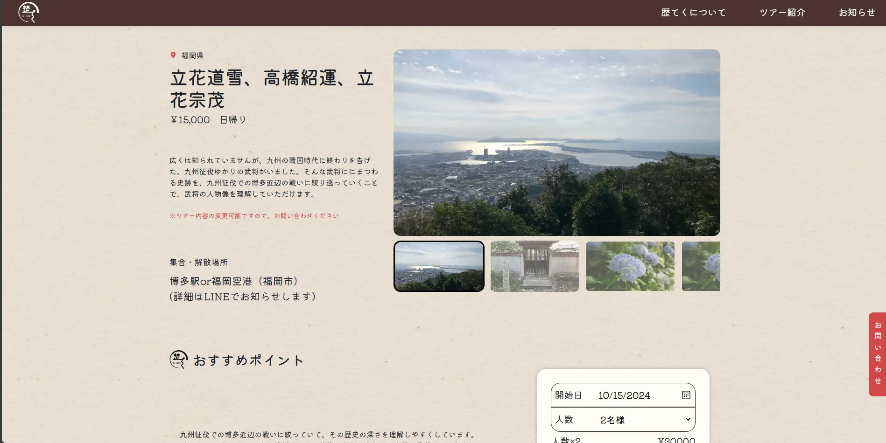

# 歴てく

  

####

  

## 紹介

これは、福岡県の歴史観光会社を準備している顧客と連携したチームプロジェクトです。

## 実装された機能

-   ユーザー向けページ：ホームページ、会社情報、ツアー情報、新着ニュースなどの情報を含む。
-   管理者向けページ：全ページで使用されるテキストの管理、編集、削除、ツアーやニュースの追加、編集、削除が可能。

## 前提条件

-   Node.js 18 を使用

## インストール

-   リポジトリをクローン `git clone <https://github.com/huynhnguyen1906/Reki-Teku.git>`
-   ディレクトリに移動 `cd Reki-Teku`
-   依存関係をインストール `npm install`
-   .env.local.example から　.env.local を作成し、環境変数を設定
-   ローカルサーバーを起動 `npm run dev`

## プロジェクト構造

プロジェクトは以下の構造を持っています：

-   src/：プロジェクトのソースコードが含まれています。
    -   app/：アプリケーションのエントリポイントが含まれています。
    -   components/：再利用可能な React コンポーネントが含まれています。
    -   hooks/：カスタム React フックが含まれています。
    -   lib/：ユーティリティ関数やライブラリが含まれています。
    -   types/：TypeScript の型定義が含まれています。
    -   utils/：共通で使用されるユーティリティが含まれています。
    -   styles/：SCSS スタイルシートが含まれています。
